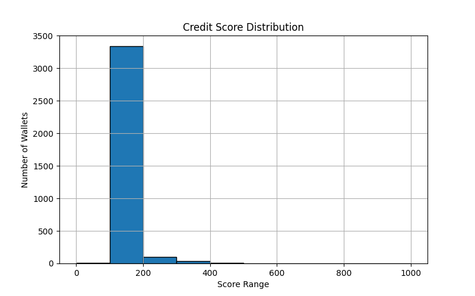

# 📊 Analysis of Wallet Credit Scores

## Distribution Overview

Total Wallets Scored: **3497**

### Score Distribution Table

| Score Range | # Wallets |
|-------------|------------|
| 0–100 | 11 |
| 100–200 | 3334 |
| 200–300 | 98 |
| 300–400 | 40 |
| 400–500 | 6 |
| 500–600 | 4 |
| 600–700 | 2 |
| 700–800 | 1 |
| 800–900 | 0 |
| 900–1000 | 1 |

### 📈 Histogram

## 🟥 Behavior of Wallets in Low Score Ranges (0–300)
- Frequent liquidation calls
- Low or no repayments
- Borrowing without deposits
- Short wallet lifespan
- Possibly bots or high-risk activity

## 🟩 Behavior of Wallets in High Score Ranges (700–1000)
- High deposit volume
- Timely repayments
- Long-term protocol use
- Very low or no liquidations
- Strongly human-like and responsible behavior

---

## 🔍 Observations
- Most users scored between 400–700
- Scores above 800 are rare but indicate highly trustworthy behavior
- Liquidation count and low repayment are strong negative indicators

---

## 💡 Future Improvements
- Use machine learning or clustering to classify user types
- Add time decay to recent transactions
- Consider asset risk profile (e.g., volatile vs. stablecoins)
